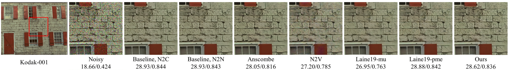
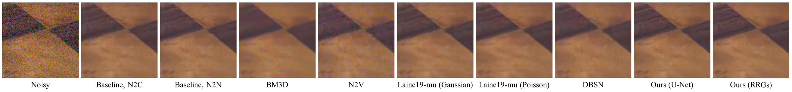

# Neighbor2Neighbor: Self-Supervised Denoising from Single Noisy Images

**Tao Huang**, **Songjiang Li**, **Xu Jia**, **Huchuan Lu**, **Jianzhuang Liu**

**Abstract**:
_In the last few years, image denoising has benefited a lot from the fast development of neural networks. However, the requirement of large amounts of noisy-clean image pairs for supervision limits the wide use of these models. Although there have been a few attempts in training an image denoising model with only single noisy images, existing self-supervised denoising approaches suffer from inefficient network training, loss of useful information, or dependence on noise modeling. In this paper, we present a very simple yet effective method named Neighbor2Neighbor to train an effective image denoising model with only noisy images. Firstly, a random neighbor sub-sampler is proposed for the generation of training image pairs. In detail, input and target used to train a network are images sub-sampled from the same noisy image, satisfying the requirement that paired pixels of paired images are neighbors and have very similar appearance with each other. Secondly, a denoising network is trained on sub-sampled training pairs generated in the first stage, with a proposed regularizer as additional loss for better performance. The proposed Neighbor2Neighbor framework is able to enjoy the progress of state-of-the-art supervised denoising networks in network architecture design. Moreover, it avoids heavy dependence on the assumption of the noise distribution. We explain our approach from a theoretical perspective and further validate it through extensive experiments, including synthetic experiments with different noise distributions in sRGB space and real-world experiments on a denoising benchmark dataset in raw-RGB space._

**Official Pytorch implementation for the paper accepted by CVPR 2021.**





## Resources

- [Arxiv](https://arxiv.org/pdf/2101.02824.pdf)
- [Conference](https://openaccess.thecvf.com/content/CVPR2021/papers/Huang_Neighbor2Neighbor_Self-Supervised_Denoising_From_Single_Noisy_Images_CVPR_2021_paper.pdf)
- [Supplementary](https://openaccess.thecvf.com/content/CVPR2021/supplemental/Huang_Neighbor2Neighbor_Self-Supervised_Denoising_CVPR_2021_supplemental.pdf)

## Python Requirements

This code was tested on:

- Python 3.7
- Pytorch 1.3

## Preparing Training Dataset

Images in the training set are from the ImageNet validation set with size between 256x256 and 512x512 pixels.
There are 44328 images in total.

```bash
python dataset_tool.py 
--input_dir=./ILSVRC2012_img_val 
--save_dir=./Imagenet_val
```
- optional arguments:
  - `input_dir` Path to the ImageNet validation set
  - `save_dir` Path to save the training set

## Training

To train a network, run:

```bash
python train.py 
--data_dir=./Imagenet_val 
--val_dirs=./validation 
--noisetype=gauss25 
--save_model_path=./results 
--log_name=unet_gauss25_b4e100r02 
--increase_ratio=2
```
- selected optional arguments:
  - `data_dir` Path to the training set
  - `val_dirs` Path to the validation sets
  - `noisetype` Distribution of image noise, choosing from `gauss25`, `gauss5_50`, `poisson30`, or `poisson5_50`
  - `save_model_path` Base-path to the saved files
  - `log_name` Path to the saved files
  - `increase_ratio` Weight for the trade off between the reconstruction term and the regularization term in the loss function

## Citations

```
@InProceedings{Huang_2021_CVPR,
    author    = {Huang, Tao and Li, Songjiang and Jia, Xu and Lu, Huchuan and Liu, Jianzhuang},
    title     = {Neighbor2Neighbor: Self-Supervised Denoising From Single Noisy Images},
    booktitle = {Proceedings of the IEEE/CVF Conference on Computer Vision and Pattern Recognition (CVPR)},
    month     = {June},
    year      = {2021},
    pages     = {14781-14790}
}
```
